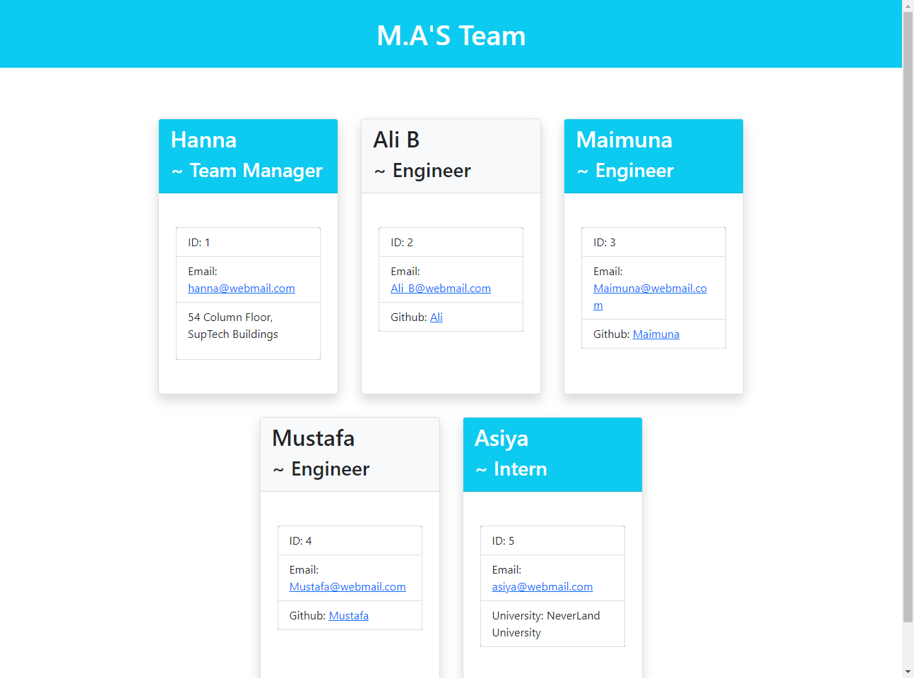

# Team-Pro-Gen
Object-Oriented Programming : Team Profile Generator

## Table of contents

1. [Description of the application](#description)
2. [Technologies used in the application](#technologies)
3. [User Story](#Userstory)
4. [Installation](#installation)
5. [Pages](#pages)


## Description 

This Team Profile generator web application powered by Node.js showcases a basic team profile which includes: A team manager, Two Engineer's, and an Intern. 

## Technologies

* JavaScript 
* Node.js 
* Jest 
* Inquirer.js

## User story

``` 
AS A manager:
I WANT to generate a webpage that displays my team's basic info
SO THAT I have quick access to their emails and GitHub profiles
```


## Installation

Steps to follow for installation:

Copy repository code and run git clone command on your your local machine.

Install npm packages by running npm i or npm run install

Install inquirer and jest packages by running npm i inquirer and npm i jest respectively.

On your terminal or command line run node index.js


## Pages  


